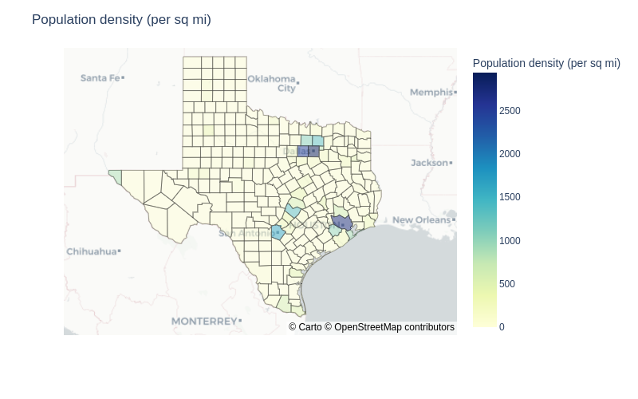

# Texas counties by land area, population, and population density

View the notebook: [texas-counties.ipynb](//github.com/christianmendoza/texas-counties/blob/main/texas-counties.ipynb)

Visualizing all 254 counties in TX by land area, population, and population density.

Using [pandas](https://pandas.pydata.org/) to clean, [seaborn](https://seaborn.pydata.org/) to generate charts, and [plotly.express](https://plotly.com/python/plotly-express/) to plot the geographics.

Dataset from:

- *Wikipedia*: [List of counties in Texas](https://en.wikipedia.org/wiki/List_of_counties_in_Texas)

